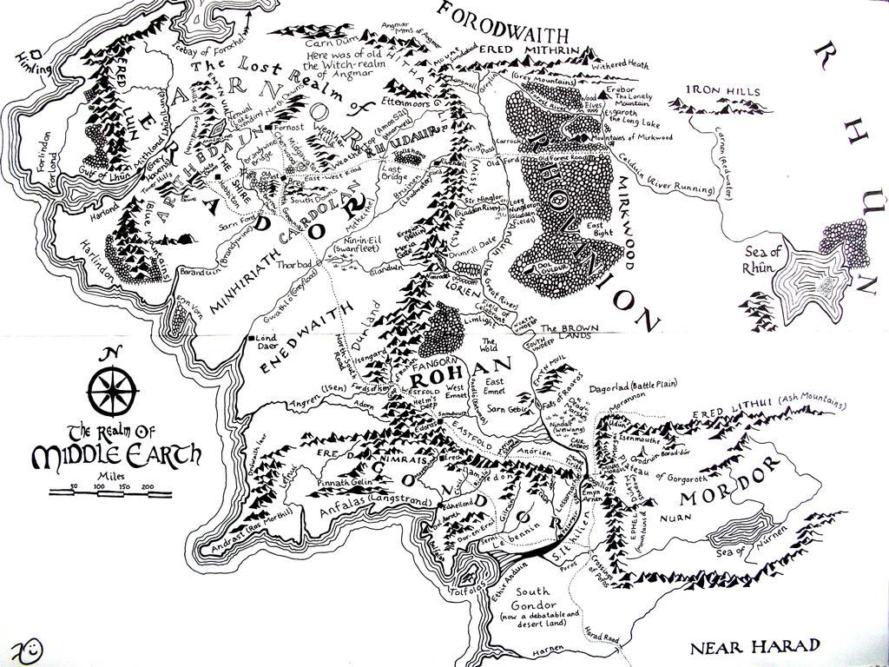
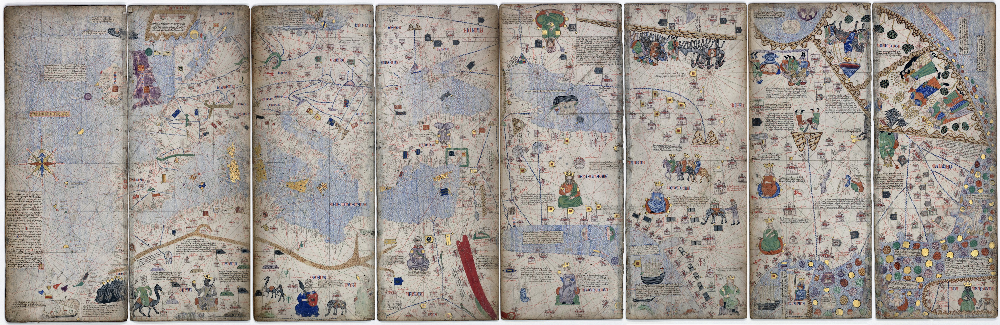
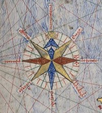
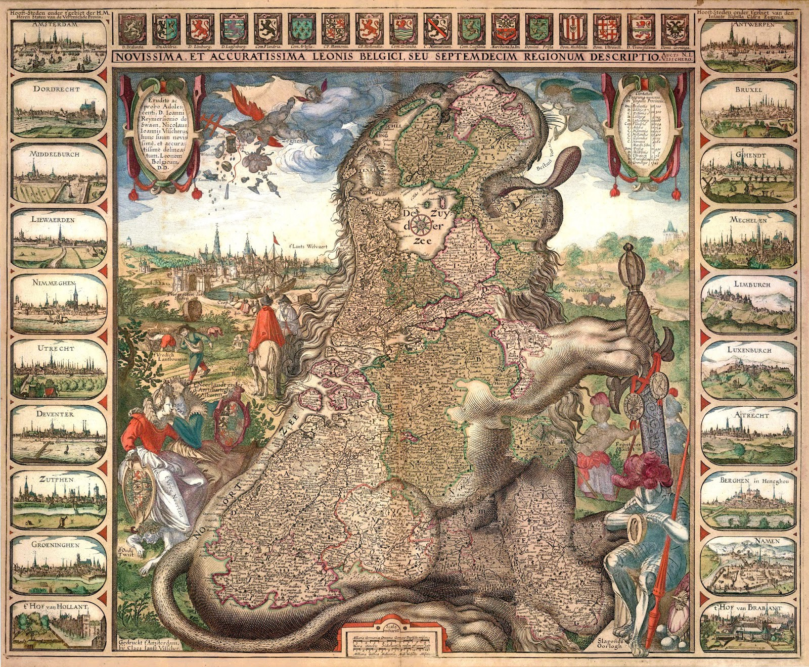
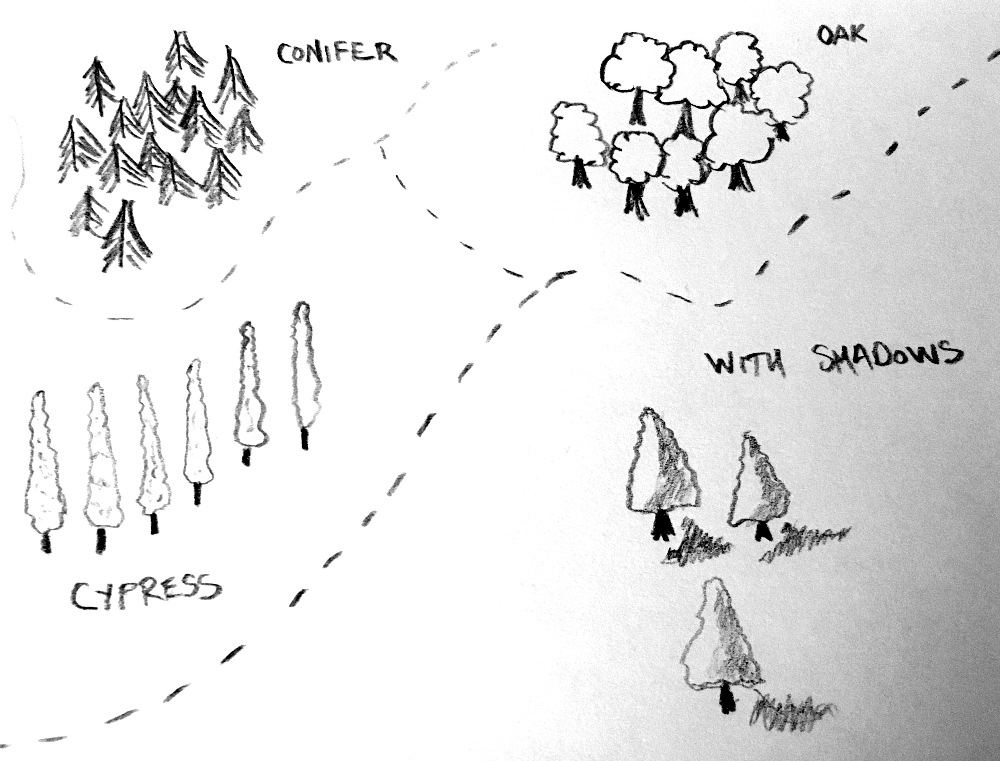
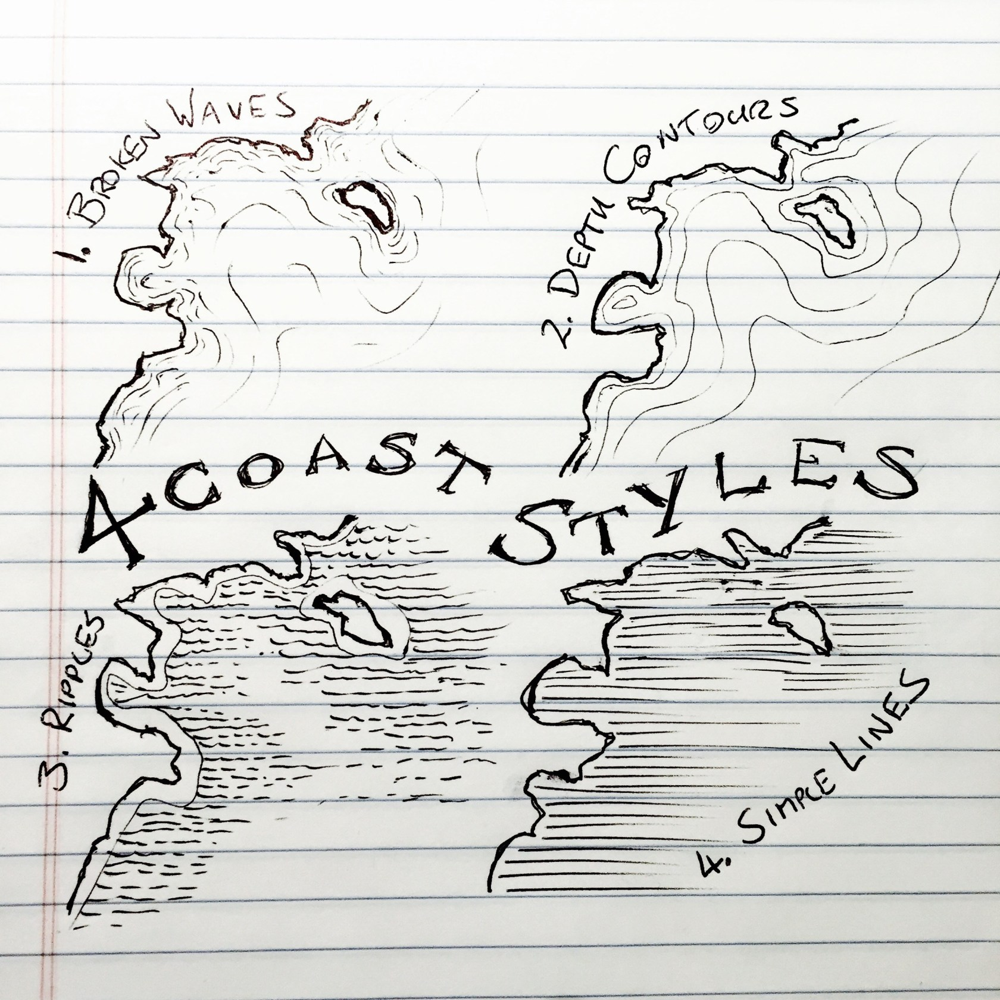

# Magical Mapmaking

This is a just-for-fun repository of random templates of compasses, maps, and mapmaking ideas that folks can use for creative purposes. 

## Magical Maps

So many wonderful examples from things like the Marauder's Map in Harry Potter, to Middle Earth maps by Tolkien (see below). What sort of magical/mythical map would you make?

## Cartography & Old Maps

Cartography is the making of a map, that defines or represents the world around them in some shape or fashion. For a longer explanation, check out [this page on Wikipedia](https://en.wikipedia.org/wiki/History_of_cartography). 

One of the first maps that used a "rose compass" was from 1375. [The Catalan Atlas](https://en.wikipedia.org/wiki/Catalan_Atlas), likely produced by Cresque Abraham is a Medieval world map, meant to be displayed on a table and walked around (see orientation of drawings shift around the edges). Lots of cool things in this map, aside from the first rose compass (see below), if you look closely you can find the drawing of the **Melusine Siren/Mermaid** that was probably used as a template for the [original Starbucks (Starbucks Coffee, Tea, and Spice) (circa 1971) logo](https://upload.wikimedia.org/wikipedia/commons/thumb/5/5d/Old_Mermaid.jpg/1599px-Old_Mermaid.jpg) on this map (bottom right)! 

Here's a close up of one of the first documented rose compasses (cardinal directions) used on a map (in the left hand panel).

## Map Styles

Through the ages, map styles have changed immensely. But they can be beautifully artistic, and it is amazing to see some of the creative maps from centuries past. Check out this map of Netherlands/Belgium/Luxembourg in the shape of a Lion from 1609 by Claes Janz Visscher ([*Leo Belgicus*](https://en.wikipedia.org/wiki/Leo_Belgicus)). The lion was commonly used in the coat of arms for that region. 

## Mapmaking Drawing Techniques

### Trees

To draw some trees for forests, fun, etc, here are a few simple examples. 

### Coastlines

For coast lines, check out this [nice set of drawings](http://www.fantasticmaps.com/2015/10/4-coast-styles-for-mapmaking/#more-2467) from Jonathan Roberts.

## Invisible Ink

Lots of fun options here, most require some sort of acid or heat in order to make the message viewable. Writing with a cottonswab is generally a good option. To make the ink show, each should be applied and allowed to completely dry.

**Here's a list of possible "inks" you can use and the *reveal* required:**

 - Fresh lemon juice (*heat*)
 - Milk (*heat*)
 - 1/4 C Baking soda + 1/4 C water (*grape juice*)
 
**Shading**

Take 2 pieces of paper and stack them up. Write on the top piece, then remove it. To reveal message on second piece, lightly shade over the bottom piece with a pencil.

